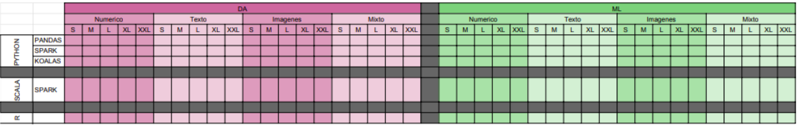

# Minuta de reunión - 14/09/23

## Participantes

Columna C: marcar con “x” convocados; Columna P: marcar con “x” presentes, “A” ausentes con aviso.

| C   | P   |     Rol     | Nombre                    |
| :-- | :-- | :---------: | :------------------------ |
| X   | X   | **Tutora**  | Wachenchauzer, Rosa       |
| X   | X   | **Cotutor** | Martinez, Gastón          |
| X   | X   |   Alumna    | Bibiloni Lombardi, Ayelén |
| X   | X   |   Alumno    | Marshall, Juan Patricio   |
| X   | X   |   Alumno    | Rinaldi, Alan             |
| X   | X   |   Alumno    | Salas, Cristian Gustavo   |

## Duracion

1 hs

## Detalles

Presentación del proyecto al equipo.

Se coordinó organizar el trabajo por caso de uso. 1era parte sobre Data Analysis para realizar el 2do cuatrimestre de 2023, y 2da parte sobre Machine Learning para el 1er Cuatrimestre de 2024, cada sección comparando sus aplicaciones sobre algoritmos numéricos, de texto, de imágenes y mixto.

Lenguajes a analizar ya decididos: Python (con Spark vs Pandas vs Koalas), Scala (con Spark) y R. Falta investigar y decidir por los 2 restantes.

Cada combinación se compararía utilizando un dataset correspondiente para el caso de uso, variando sus tamaños entre las categorías Small/Medium/Large/XL/XXL.

Se comentó sobre la posibilidad de hostear las pruebas en el cluster del Conicet, de virtualizar los recursos de infraestructura con k8s o docker swarm, aún queda por investigar y definir.

## Adjuntos

